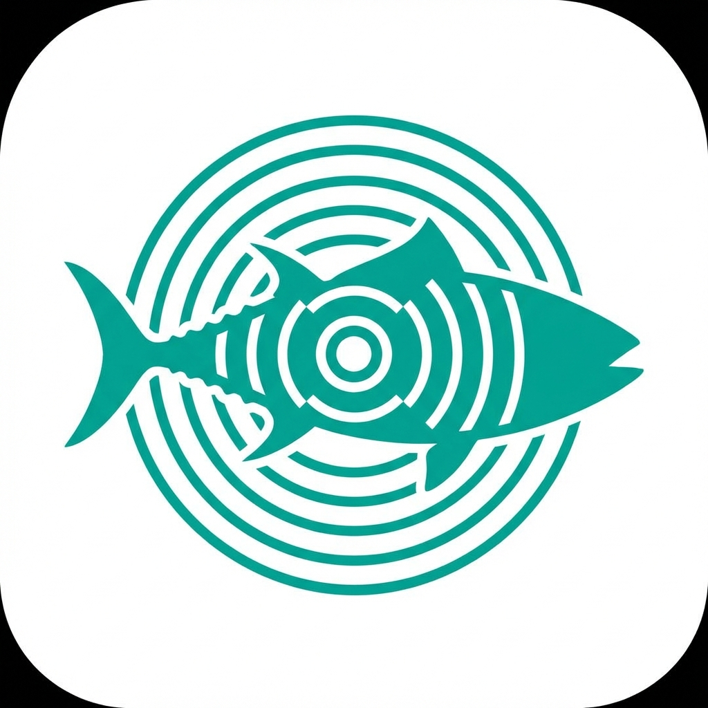
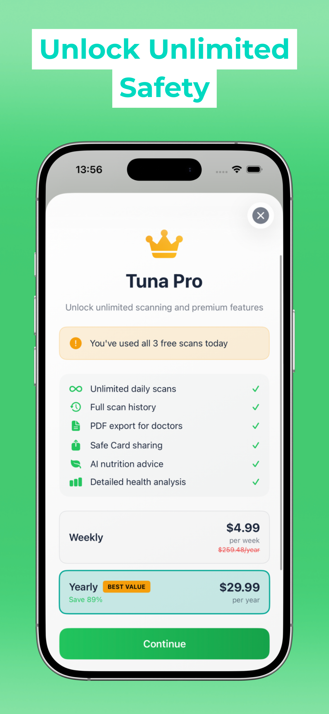

<p align="center">
  
</p>

<h1 align="center">Tuna</h1>

<p align="center">
  <strong>AI-Powered Food Scanner & Allergen Detector</strong>
</p>

<p align="center">
  <em>Know What's Truly Inside. Eat with Confidence.</em>
</p>

<p align="center">
  <a href="https://apps.apple.com/app/id6757370781">
    
  </a>
  
  
</p>

<p align="center">
  <a href="#features">Features</a> •
  <a href="#how-it-works">How It Works</a> •
  <a href="#screenshots">Screenshots</a> •
  <a href="#pricing">Pricing</a> •
  <a href="#tech-stack">Tech Stack</a> •
  <a href="#contact">Contact</a>
</p>

---

## 🎯 The Problem

**1 in 10 people** worldwide suffer from food allergies. Reading ingredient labels is tedious, error-prone, and sometimes impossible with tiny fonts or foreign languages. A single mistake can mean a hospital visit—or worse.

## 💡 The Solution

**Tuna** is your personal AI health guardian. Simply scan any food label, and Tuna's advanced AI will instantly:

- ✅ Detect allergens based on YOUR specific dietary profile
- ✅ Highlight dangerous ingredients in red
- ✅ Provide a safety verdict in seconds
- ✅ Give you personalized nutrition advice

> *"It's like having a nutritionist in your pocket—one that reads 10x faster and never gets tired."*

---

## ✨ Features

<table>
<tr>
<td width="50%">

### 🧠 Instant AI Analysis
Powered by **Google Gemini Flash 2.0**, Tuna analyzes ingredient lists in milliseconds with accuracy that rivals professional nutritionists.

### 🚨 Proactive Allergen Alerts
Custom risk profiles for **Gluten, Lactose, Nuts, Shellfish**, and more. Get instant visual alerts for any ingredient that matches your sensitivities.

### 📊 NOVA Health Scoring
Understand food processing levels at a glance—from natural whole foods to ultra-processed. Make informed decisions about what you eat.

</td>
<td width="50%">

### 📄 Medical-Grade Reports
Export your scan history to **PDF format**, ready to share with your doctor, allergist, or nutritionist. Professional documentation at your fingertips.

### 🆔 Safe Card Sharing
Generate a personalized **Safe Card** with your dietary restrictions. Share it with restaurants, friends, or caregivers. Dine out with confidence.

### 💬 AI Nutrition Advice
Get personalized recommendations and healthier alternatives powered by intelligent analysis of your eating patterns.

</td>
</tr>
</table>

---

## 🔄 How It Works

```
┌─────────────┐      ┌─────────────┐      ┌─────────────┐      ┌─────────────┐
│   📸 SCAN   │ ──▶  │  🤖 ANALYZE │ ──▶  │  ⚠️ DETECT  │ ──▶  │  ✅ RESULT  │
│  Take photo │      │  Gemini AI  │      │  Allergens  │      │  Safe/Danger│
│  of label   │      │  processes  │      │  identified │      │  + Advice   │
└─────────────┘      └─────────────┘      └─────────────┘      └─────────────┘
```

1. **Scan** — Point your camera at any ingredient list
2. **Analyze** — Gemini AI extracts and processes all ingredients
3. **Detect** — Matches against your personal risk profile
4. **Result** — Get a clear verdict with detailed breakdown

---

## 📱 Screenshots

<p align="center">
  
  
  
  
</p>

<p align="center">
  
  
  
  
</p>

---

## 💰 Pricing

| Plan | Price | Features |
|------|-------|----------|
| **Free** | $0 | 3 scans/day, Basic allergen detection |
| **Pro Weekly** | $4.99/week | Unlimited scans, Full history, PDF export, Safe Card |
| **Pro Yearly** | $29.99/year | Everything in Weekly + AI Nutrition Advice + Priority Support |

> 💡 **Save 88%** with the yearly plan compared to weekly billing!

All plans include a **7-day free trial**. Cancel anytime.

---

## 🛠 Tech Stack

| Layer | Technology |
|-------|------------|
| **Platform** | iOS 18.5+ (SwiftUI) |
| **AI Engine** | Google Gemini Flash 2.0 |
| **Backend** | Firebase (Remote Config, Analytics) |
| **Payments** | RevenueCat + StoreKit 2 |
| **Design** | Human Interface Guidelines, Swiss Style |

---

## 🔒 Privacy First

- **No account required** — Your data stays on YOUR device
- **No cloud storage** — Scan history stored locally
- **Minimal data collection** — Only what's needed for analysis
- **GDPR compliant** — Full control over your data

Read our full [Privacy Policy](https://ahmettzorlutuna.github.io/tuna-legal/PRIVACY_POLICY.md).

---

## 📬 Contact

<p align="center">
  <strong>Ahmet Tayyip Zorlutuna</strong><br>
  Independent iOS Developer
</p>

<p align="center">
  <a href="mailto:azorlutudev@gmail.com">
    
  </a>
</p>

---

## 📋 Legal

- [Privacy Policy](https://ahmettzorlutuna.github.io/tuna-legal/PRIVACY_POLICY.md)
- [Terms of Service](https://ahmettzorlutuna.github.io/tuna-legal/TERMS_OF_SERVICE.md)
- [Medical Disclaimer](https://ahmettzorlutuna.github.io/tuna-legal/MEDICAL_DISCLAIMER.md)

> ⚠️ **Important:** Tuna is an informational tool and NOT a medical device. Always verify ingredients on physical labels and consult healthcare professionals for allergy-related decisions.

---

<p align="center">
  <a href="https://apps.apple.com/app/id6757370781">
    
  </a>
</p>

<p align="center">
  Made with ❤️ in Turkey 🇹🇷
</p>

<p align="center">
  <sub>© 2026 Ahmet Tayyip Zorlutuna. All rights reserved.</sub>
</p>
